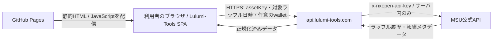

# Raffle Calculator 仕様書

> 状態: Approved / ユーザー承認済み・対象ボス明確化済み（2026-08-01）  
> 対象: Lulumi-Tools Web、Lulumi APIサーバー  
> 公開ページ: `#/raffle`  
> 初版作成日: 2026-08-01  
> 実装: 承認済み計画に基づき着手済み。安全に独立実装できるWeb・fixture APIを先行し、実API正規化は停止条件を維持する。  
> 前提監査: [Raffle API 前提監査](./SPIKE_RAFFLE_API_ASSUMPTIONS.md)に匿名化した結果を記録する。

## 1. 目的

Lulumi-Toolsに、MSU公式APIから取得したラッフル履歴を基に、パーティ内の獲得物をNESO換算し、最終的な支払・受取額を計算する「Raffle Calculator」を追加する。

MapleHubの操作体験を参考にするが、コードや内部ロジックは流用せず、Lulumi-Tools向けに独立して設計・実装する。

初期版で解決することは次のとおり。

- キャラクターごとの公式ラッフル履歴を読み込み、Lucid・Will・その他ボスを含む取得結果をすべて表示する。
- 保存PTを分配対象者として扱い、同一開催回・同一Lucid / Will難易度・同一公式PT人数・ラッフル参加時刻の幅1時間以内を満たす履歴群を分配候補として検出する。公式討伐人数、保存PT内の履歴参加人数、保存PTの分配人数は独立して扱い、不一致時はユーザーが明示確認した場合だけ保存PT人数で計算する。履歴がないメンバーも獲得0で均等分配へ含める。
- ボスNESO、Power Crystal、Ascendant NESO、コイン売却額、装備売却額を選択に応じてNESO価値へ換算する。
- `Power Crystal 1 = X NESO` の換算レートをユーザーが指定できる。
- 分配はボスごとに独立して行う。LucidではPhantasma Coin、WillではArachno Coinだけを対象とし、実際の取得者がドロップ1件ごとの売却総額を入力する。
- パーティ内で均等分配した場合の差額と、必要な送金一覧を表示する。

## 2. 初期版の対象外

次は初期版には含めない。

- ラッフルへの参加、エントリー、抽選実行
- 未抽選のリアルタイム状況表示
- マーケット価格の自動取得
- 装備やその他アイテムの自動査定
- MSUアカウントへのログインやウォレット署名
- 公式APIレスポンスの恒久的な収集・公開
- 30日を超える履歴の独自アーカイブ
- Lucid・Will以外のボスラッフルの分配
- Florin、AbsoLab Coin、Stigma Coinその他のExchange Currencyの価格入力・分配

将来追加する場合も、初期版の履歴分配機能とは分離して仕様を作成する。

## 3. 前提と制約

### 3.1 Lulumi-Toolsの公開方式

Lulumi-Tools本体はGitHub Pagesで配信される静的SPAである。GitHub PagesのJavaScript、ビルド成果物、環境変数には秘密情報を保持できない。

したがって、WebブラウザからMSU公式APIへ直接アクセスしてはならない。公式APIキーを利用する通信は、LULU-049で定めた新VPS上のLulumi APIサーバーだけが行う。



VPSが停止していてもLulumi-Toolsの画面自体は表示できることを維持する。Raffle Calculator内だけに「APIサーバーへ接続できない」状態を表示し、EXP RankingやTask Managerを巻き込まない。

### 3.2 公式APIについて確認できた事項

一次資料: [MSU Open API Introduction](https://docs.msu.io/msu-open-api/introduction)、[Get Character Raffle History](https://docs.msu.io/msu-open-api/rewards/get-character-raffles-history)、[Get Reward Information](https://docs.msu.io/msu-open-api/rewards/get-reward-information)、[Get Layer Static Data](https://docs.msu.io/msu-open-api/rewards/get-layer-static)

- APIベースURLは `https://openapi.msu.io`。
- ラッフル履歴はキャラクターのasset key、wallet address、`raffled_at`を指定して取得する。
- 履歴の取得可能期間は公式仕様上30日。
- サンドボックスキーの公称レート制限は2 requests/second。
- 公式ドキュメント上のDefault quotaは3,000 requests/dayで、00:00 UTCにリセットされる。
- 実測では短時間の連続リクエストでHTTP 429が返るため、初期版は1秒に1リクエスト以下で直列化する。
- `0kn0`、`2026-07-30T00:00:00Z` の組み合わせでは、24件のラッフル履歴を取得できた。
- 現在のowner walletとラッフル当時のwalletが異なる場合や、キャラクターがunlink済みの場合、履歴が空になる可能性がある。この挙動は未確定事項として実装前検証を続ける。

### 3.3 既存プロジェクト方針との整合

- キャラクターの同一性は名前ではなく既存の`historyKey` / `assetKey`を基準にする。
- 新規UI文言は既存の6ロケールすべてに追加する。
- 保存キーは`maplen-board-*`形式にする。
- 新しいnpm依存関係は追加しない。必要になった場合は、導入前に別途承認を得る。
- 静的SPAの配信経路にVPSを挟まない。
- 本番WebからAPIサーバーへのCORS許可元は原則 `https://lulumi-tools.com` のみにする。ローカル開発元は開発環境でのみ追加する。

### 3.4 MapleHub現行画面から確認した参考動作

2026-08-01時点のMapleHub画面で、次を確認した。

- パーティは最大6キャラクターで、名前付きの保存パーティを切り替えられる。
- ラッフル読込時は全キャラクターが同じworldであることを要求する。
- ダッシュボードは`Raffle Entry`、`Raffle Results`、`Party Clears`の3タブで構成される。
- `Raffle Results`はlayerごとにラッフル日時、成功状態、claim状態、参加人数、直接NESO、Power Crystal量、各報酬スロットのWIN / LOSEを表示する。
- `0kn0`では`2026/7/30 09:00`（JST、同日00:00 UTC）の結果を表示できた。
- Power Crystal表示は「個数」ではなく、`50M + 50M + 50M = 150M`のような量の合計として表示される。
- `Party Clears`は保存パーティを分配対象者として、PT内のいずれかのキャラクターに存在するLucid / Will履歴を難易度別に確認・選択する画面とする。

これらは参考動作であり、画面や内部処理を複製する根拠にはしない。Lulumi-Toolsでは秘密キー保護、ドロップ1件ごとの売却総額入力、不完全履歴の検出を追加する。

## 4. 画面とナビゲーション

### 4.1 ページ名とURL

- 表示名: `Raffle Calculator`
- ハッシュルート: `#/raffle`
- ヘッダー内の順序: `EXP Ranking` / `Task Manager` / `Raffle Calculator`
- Raffle Calculator表示中は、同ナビゲーション項目をアクティブ表示する。

### 4.2 画面構成

1ページ内を次の5領域に分ける。

1. パーティ設定
2. PTラッフル履歴読込と公式開催回表示
3. Raffle Results
4. Party Clearsとボス別分配設定
5. 分配結果・送金一覧

スマートフォンでは縦1列、デスクトップでは設定領域と結果領域を分けた2列表示を基本とする。

取得後の結果領域には、次の2タブを設ける。

- `Raffle Results`: キャラクター別・layer別の当選結果と報酬内訳。ボス種別にかかわらず、取得できた抽選済み結果をすべて表示する。
- `Party Clears`: LucidまたはWillの同一クリア突合結果、Complete / Incomplete、分配計算。その他ボスはここへ含めない。

初期版では未抽選データを扱わないため、MapleHubにある`Raffle Entry`タブは設けない。

## 5. ユーザーフロー

1. ユーザーが保存済みPTを選ぶか、新しいPTを作成する。
2. 最大6キャラクターを追加し、同一worldであることを確認する。
3. 「PTのラッフル履歴を読み込む」を押す。
4. Webは現在時刻から直近の木曜日00:00 UTCを公式ラッフル開催回として求め、PT全メンバーを1jobで取得する。
5. `Raffle Results`でPTメンバーを1人選び、そのキャラクターが当該開催回で当選した全ラッフルを確認する。ボス種別は限定しない。`Ascendant Tier Raffle`は開催回内で1つにまとめ、各当選を`階層名 - 難易度 ボス名`形式で表示する。対応はDawning 1＝Normal Guardian Angel Slime、Dawning 2＝Easy Lucid、Blessed 1＝Hard Lotus、Blessed 2＝Hard Damien、Mystic＝Normal Lucid、Luminous＝Easy Will、Glorious＝Normal Will、Divine＝Hard Lucid、Eternal＝Hard Willとする。表示順はこの表の下側を高Tierとして、EternalからDawning 1へのTier降順とする。
   - 選択キャラクターの当選を全件集計し、合計NESOと券の額面換算後の合計Power Crystalを常時表示する。同名報酬のアイテム別合計一覧は初期状態で折り畳む。
6. `Party Clears`で、同一公式PT人数を持ち、複数履歴ではラッフル参加時刻が1時間以内に収まるLucidまたはWillを難易度別候補として確認する。各候補は`Normal Will + Glorious Ascendant`のように公式難易度と対応Ascendant Tierを一体表示し、討伐人数／履歴参加人数／分配人数を併記する。3人数が不一致なら候補ごとの確認チェックを必須とする。同一ボスに複数候補がある場合はチェックで1件以上を選び、複数選択時は獲得額を合算する。
7. ボスタブ内で分配へ含める項目を選び、必要な売却額とPower Crystal換算率を入力する。
8. 「分配計算」を押し、各メンバーの獲得価値、均等取り分、差額、送金一覧を確認する。

履歴取得中は、待ち行列、キャラクター取得、履歴取得、正規化の進行段階と経過時間を表示する。実際の完了人数だけを表示し、推測値は使わない。未キャッシュ6キャラクターの通常時目標は30秒以内とする。

## 6. パーティ設定

### 6.1 キャラクター追加方法

次の方法を提供する。

- キャラクター名を入力し、VPSバックエンド経由でMSU公式APIを完全一致検索する。
- MSU NavigatorのキャラクターURLを貼り付ける。

名前検索は公式`/v1rc1/search/suggest?type=character`の候補から大文字小文字を区別しない完全一致だけを採用し、候補のasset keyまたはtoken IDから公式キャラクター詳細を再取得して確定する。APIキーはVPSだけが保持し、ブラウザには渡さない。raw asset keyの直接入力欄は提供しない。

同じasset keyを同一パーティへ重複追加できない。キャラクター名は表示用スナップショットであり、同一性判定には使用しない。

パーティ内のキャラクターはすべて同一worldでなければならない。異なるworldのキャラクターを追加した時点で警告し、履歴取得を無効化する。worldは表示名ではなく公式のworld IDで比較する。

### 6.2 walletの解決

通常はAPIサーバーが公式のキャラクター詳細から現在のowner walletを解決する。

履歴が空で、unlinkまたはowner変更が疑われる場合に限り、「当時のwalletを指定する」詳細入力を表示できるようにする。入力されたwalletは形式検証し、当該リクエストにだけ利用する。初期版ではlocalStorageへ自動保存しない。

wallet指定を許可しても任意のMSU APIパスは指定できず、サーバー側で決めたラッフル履歴取得処理だけを実行する。

### 6.3 保存

ユーザーは複数のパーティをブラウザ内に保存できる。

- 最大保存数: 10パーティ
- 1パーティ: 最大6キャラクター
- 保存先: localStorage
- 外部サーバーへのパーティ設定保存: 行わない

パーティごとの保存対象はパーティ名、キャラクターのasset key、表示名、持ち越し利用フラグ、メンバー別の前回持ち越し額とする。分配項目、Power Crystal換算率、ドロップ売却額、wallet override、生履歴、APIキーは保存しない。

## 7. 公式ラッフル開催回

初期版の「今週」はMSU公式ラッフル開催回を指し、毎週木曜日00:00 UTCを境界とする。

- Webは現在時刻以前で直近の木曜日00:00 UTCを決定的に算出する。
- 利用者へ通常の日時入力欄を出さない。
- APIサーバーは受け取った`raffledAt`が木曜日00:00 UTCかつ公式保持期間内であることを検証する。
- 公式履歴APIが指定回以外の履歴も返す可能性があるため、各履歴の`history.raffledAt`を完全一致で再検証する。
- 画面には対象開催回をUTCとユーザーローカル時刻で表示する。

## 8. Party Clearsの分配設定

分配設定は履歴読込前ではなく、選択したLucidまたはWillのボスタブ内に表示する。難易度別候補には対応Ascendant Tierを併記し、同一ボスで複数選択した候補は1つの分配設定へ合算する。

### 8.1 分配項目

次の5項目をチェックボックスで個別に加算対象へ含められる。

- コイン
- 装備ドロップ
- ボスNESO
- Power Crystal
- Ascendant NESO

LucidではPhantasma Coin、WillではArachno Coinだけをコインとして扱う。その他通貨はRaffle Resultsへ表示するが分配項目へ含めない。

### 8.2 Power Crystal

Power Crystalを選択した場合、ボスタブ単位で`Power Crystal 1 = X NESO`を入力する。初期値は`1`。0以上、小数18桁以下の有限10進数を許可し、1 NESO未満の端数が出る場合は丸めず計算を停止する。

Power Crystalは均等な権利額を求めるための価値には含めるが、キャラクター間で交換・送付できないため実送金の原資には含めない。送金可能額はボスNESO、Ascendant NESO、コイン売却額、装備売却額の合計に限定する。

### 8.3 コイン・装備ドロップ

コインまたは装備ドロップを選択した場合、API履歴で実際に当選したドロップを取得者ごと・ドロップ1件ごとに表示し、その売却総額をNESO整数で入力する。

- コイン1個の単価入力ではない。
- 当該カテゴリを獲得していないメンバーには入力欄を出さない。
- 複数装備は1件ごとに別入力とする。
- 空欄は未設定、`0`は無価値として明示した値とする。
- 売却額は当該計算中だけ保持し、localStorageへ保存しない。
- コインは当選数量を表示する。
- 装備は公式item metadataのアイコンを表示し、ホバーまたは支援技術向けラベルでアイテム名と数量を確認できるようにする。

### 8.4 ボスNESO・Ascendant NESO

チェック時はAPIから正規化された当選額をそのまま加算する。ユーザーによる価格入力は不要。公式フィールド対応は匿名化fixtureで確定し、推測フィールドを使用しない。

## 9. 公式データの正規化

### 9.1 利用する公式エンドポイント

APIサーバーだけが次の公式APIを利用する。

- キャラクター名検索: Suggest APIの完全一致候補をキャラクター詳細で確定する。
- キャラクター詳細: asset keyから現在のowner wallet、world等を解決する。
- ラッフル履歴: asset key、wallet、`raffled_at`から履歴を取得する。
- 報酬情報: worldごとの報酬キー、アイテム、数量等を解決する。

現在開催中ラッフルのエンドポイントは初期版の分配計算には使用しない。

### 9.2 正規化する単位

公式レスポンスの1履歴に複数の`clearInformations`が含まれる可能性を考慮し、サーバー側では「キャラクター × 1クリア」の単位へ展開する。

概念上のクリア識別子は次を組み合わせる。

- `raffledAt`
- `layerId`（対象ボスと難易度を一意に表す）
- 公式データから識別した対象ボス（LUCIDまたはWILL）

同一開催回内で`layerId`ごとに難易度別の分配候補を生成する。公式`partyCount`が同じ履歴をまとめ、複数履歴では`clearedAt`（ラッフル参加時刻）が最古から最新まで1時間以内に収まる最大グループを同一PT候補とする。保存PT人数との一致は候補生成条件にしない。履歴1人でも候補を生成するが、公式討伐人数・履歴参加人数・保存PTの分配人数が完全一致しない候補はWebで明示確認するまで計算できない。同人数の最大グループまたは異なる公式PT人数の最大候補が複数ある場合は推測せず候補外として警告する。履歴参加人数は公式討伐人数以下とし、該当履歴がない保存PTメンバーは獲得額0として候補の`members`へ含め、履歴が存在するメンバーは`historyMemberIds`で明示する。時刻は秒単位の一致を要求せず、1時間を超える履歴を別PTとして除外する。

Ascendant Tier Raffle履歴の`clearInformations`は実データでは空であり、ボスの`clearedAt`では対応付けられない。分配用のAscendant NESOとPower Crystalは、同一開催回内でボスlayerの難易度から§6の対応表によりTierを一意に決定して結び付ける。Lucid Easy＝Dawning 2、Lucid Normal＝Mystic、Lucid Hard＝Divine、Will Easy＝Luminous、Will Normal＝Glorious、Will Hard＝Eternalとする。対象Tierが0件または複数件なら推測で合算しない。

### 9.3 報酬分類

サーバーは全ボスの抽選済み当選を`Raffle Results`表示用に1件ごとに正規化する。さらに公式のlayer情報からLucidまたはWillの難易度別候補を生成し、分配用`Party Clears`には各ボス最大3件（Easy / Normal / Hard）を含める。各候補の`members`は保存PT全員、`historyMemberIds`はその候補の履歴があるメンバーだけとする。公式のreward keyと報酬メタデータを照合し、各獲得物を次のいずれかへ分類する。

- `NESO`
- `POWER_CRYSTAL`
- `COIN`
- `OTHER`
- `UNKNOWN`

特定の`itemId`をフロントエンドへハードコードしない。報酬メタデータの解釈をサーバー側へ集約し、分類規則にはバージョンを付ける。

`OTHER`と`UNKNOWN`は初期版のNESO換算から除外し、画面に目立つ警告を表示する。未知の報酬を黙って0価値として扱ってはならない。

### 9.4 winCountとreceivedCount

分配対象数量には、ラッフル結果として当選した数量を示す`winCount.value`を使用する想定とする。`receivedCount.value`は受取・claim状態の表示に使用し、価値計算には使用しない。

この解釈は実装開始前に、`0kn0`の実データと公式仕様で再確認する。意味が一致しない場合は本仕様を改訂する。

## 10. 分配計算

分配計算の正はWeb側の純粋関数とする。Lulumi APIサーバーは取得・検証・正規化だけを担当する。

### 10.1 キャラクターごとの獲得価値

選択された項目だけを加算する。

```text
gross(c)
  = checked(BOSS_NESO)       ? bossNeso(c) : 0
  + checked(POWER_CRYSTAL)   ? powerCrystalAmount(c) × powerCrystalNesoRate : 0
  + checked(ASCENDANT_NESO)  ? ascendantNeso(c) : 0
  + checked(COIN)            ? Σ coinDropSaleNeso(c, drop) : 0
  + checked(EQUIPMENT)       ? Σ equipmentDropSaleNeso(c, drop) : 0
```

コイン・装備がチェック済みで対象ドロップの売却額が空欄なら計算しない。未チェック項目の入力値や公式数量は計算へ含めない。

### 10.2 均等分配

選択した難易度候補の獲得額をメンバー別に合算し、履歴の有無にかかわらず保存PT全員を分母として均等分配する。

```text
total = Σ gross(c)
baseShare = floor(total / participantCount)
remainder = total mod participantCount
balance(c) = gross(c) - assignedShare(c)
```

余りは保存PTの表示順で先頭から1 NESOずつ割り当てる。支払側と受取側を同じ表示順の2ポインター方式で照合し、最終送金一覧を生成する。

### 10.3 Power Crystal非送金と持ち越し

PT設定で持ち越しを有効にした場合、メンバーごとに前回持ち越し額を符号付きNESO整数で入力する。`+`は今回受け取る権利、`-`は今回支払う義務を表し、PT全体の入力合計は0でなければ計算しない。

```text
transferableNeso(c)
  = checked(BOSS_NESO)      ? bossNeso(c) : 0
  + checked(ASCENDANT_NESO) ? ascendantNeso(c) : 0
  + checked(COIN)           ? Σ coinDropSaleNeso(c, drop) : 0
  + checked(EQUIPMENT)      ? Σ equipmentDropSaleNeso(c, drop) : 0

adjustedBalance(c) = gross(c) - assignedShare(c) - previousCarryover(c)
actualPayment(c) = min(max(adjustedBalance(c), 0), transferableNeso(c))
```

実送金は`actualPayment`の合計を上限として受取側へ割り当てる。支払えなかった義務は負、受け取れなかった権利は正として`nextCarryover`へ残し、その合計は0とする。持ち越しを無効にした場合は従来どおり、個人保有NESOを利用して差額を全額精算する。

### 10.4 ボス分離

LucidとWillが両方存在する場合は別タブ、別設定、別計算、別送金一覧とし、ボス間では相殺しない。同一ボス内に複数難易度の履歴候補がある場合はユーザーがチェックで選択し、1件選択ならその候補だけ、複数選択なら選択候補のBoss NESO・Power Crystal・Ascendant NESO・コイン・装備売却額をメンバー別に合算して1回の分配を行う。

### 10.5 不完全なパーティ履歴

同一開催回・同一Lucid / Will難易度・同一公式`partyCount`で、複数履歴の参加時刻の幅が1時間以内ならParty Clears候補を表示する。公式討伐人数、履歴参加人数、保存PTの分配人数はそれぞれ1〜6人で独立してよく、特定の組み合わせへ固定しない。たとえば6人討伐・4人履歴・6人分配、6人討伐・5人履歴・5人分配のどちらも扱う。3人数が完全一致しない場合、候補ごとに「登録済みN人で分配する」確認を必須とし、未確認では計算ボタンを無効にする。履歴がない保存PTメンバーは獲得額0として含める。同一ボスに複数難易度がある場合はユーザーが分配へ含める候補を1件以上選択し、複数選択時は合算する。

## 11. Lulumi APIサーバー

### 11.1 サービス分離

LULU-049で定めた新VPS上に、既存の画像プロキシとは別プロセスの`raffle-api`として実装し、同じ `api.lulumi-tools.com` の別パスで公開する。画像機能の障害とラッフル機能の障害を分離する。新VPSはRAM 1GBであるため、常駐メモリ、同時処理数、キャッシュ上限を実装計画前に計測し、画像プロキシを含む余裕を確認する。

推奨パス:

- `GET /raffle/v1/health`
- `POST /raffle/v1/characters/resolve`

- `POST /raffle/v1/jobs`
- `GET /raffle/v1/jobs/{opaqueJobId}`
- `DELETE /raffle/v1/jobs/{opaqueJobId}`

### 11.2 ブラウザからのリクエスト

概念上のリクエスト例:

```json
{
  "raffledAt": "2026-07-30T00:00:00Z",
  "characters": [
    {
      "memberId": "member-1",
      "assetKey": "CHAR..."
    },
    {
      "memberId": "member-2",
      "assetKey": "CHAR...",
      "walletOverride": "0x..."
    }
  ]
}
```

制限:

- 1リクエスト最大6キャラクター
- 全キャラクターのworld IDが一致すること
- asset keyは許可した形式だけを受け付ける
- wallet overrideは公式形式に一致する値だけを受け付ける
- `raffledAt`はUTCのISO 8601で、取得可能期間内に限定する
- `raffledAt`は毎週木曜日00:00 UTCだけを受け付ける
- リクエストボディ上限を設定する
- URLや公式APIパスを利用者に指定させない

### 11.3 ブラウザへのレスポンス

公式レスポンスをそのまま返さず、表示と分配に必要な情報だけへ正規化する。`raffleResults`には当該開催回の全ボスの当選を1件ごとに、`clears`には同一公式PT人数かつ参加時刻の幅1時間以内で同一PT候補と判定したLucid / Willを難易度別にボスごと最大3件返す。各候補の`partyCount`は公式討伐人数、`members`は保存PT全員、`historyMemberIds`は履歴保有者だけを表し、3人数を同一値へ上書きしない。

`schemaVersion`はWeb↔raffle-apiレスポンス全体の構造バージョン、`classificationVersion`は報酬分類規則のバージョンとする。互換性のない契約変更では`schemaVersion`を更新し、分類規則だけの変更では`classificationVersion`を更新する。

```json
{
  "schemaVersion": 3,
  "classificationVersion": 1,
  "status": "complete",
  "progress": {
    "completedCharacters": 2,
    "totalCharacters": 2,
    "stage": "complete",
    "elapsedMs": 1200
  },
  "raffleResults": [
    {
      "resultId": "opaque-result-id",
      "memberId": "member-1",
      "raffledAt": "2026-07-30T00:00:00Z",
      "layerName": "Example Layer",
      "bossCode": null,
      "bossName": "Example Boss",
      "outcome": "WIN",
      "rewards": []
    }
  ],
  "clears": [],
  "warnings": [],
  "errors": []
}
```

ステータスは少なくとも次を区別する。

- `ok`
- `empty`
- `wallet_mismatch_suspected`
- `rate_limited`
- `upstream_unavailable`
- `invalid_metadata`

1キャラクターの失敗で全件を失敗させず、取得できた結果と失敗理由を部分レスポンスとして返す。ただしIncompleteなクリアは計算対象外となる。

### 11.4 レート制限、再試行、キャッシュ

サンドボックス運用時の初期値:

- MSU APIへの送信はサーバー全体で直列化する。
- 開始間隔は1,000ms以上とする。
- HTTP 429では`Retry-After`を優先し、存在しなければ1秒、2秒、4秒で最大3回再試行する。
- 1利用元からのjob作成、resolve、pollにもサーバー側レート制限を設ける。
- キャラクター詳細はowner変更を反映できる短TTLとする。
- 正常に取得・正規化できた公開アイテムmetadataは、VPS内の専用SQLiteへ30日間・最大10,000件で永続キャッシュする。期限切れは再取得し、失敗・UNKNOWN・APIキー・wallet・assetKey・ラッフル履歴は保存しない。
- 報酬メタデータは全メンバーの履歴取得完了を待たず、各メンバーの履歴取得直後に新規itemIdだけを取得・キャッシュする。後続メンバーの上流遅延で先行メンバーの分類情報まで失わない。
- 過去ラッフルの`winCount`を基にした価値計算用データは不変データとして長TTLを許可する。
- 表示用の`receivedCount` / claim状態は変化し得るため、価値計算用データと分離して短TTLまたは再検証対象とする。
- TTLは取得時刻だけで一律に決めず、データの可変性と公式の更新指標に従う。
- 失敗レスポンスを長時間キャッシュしない。

アイテムmetadata以外のTTL、キャッシュ容量、利用元レート制限は、実測値を取った上で実装計画に確定値を記載する。

### 11.5 タイムアウト

- 公式API 1回あたりに明示的な接続・応答タイムアウトを設定する。
- 通常応答時の未キャッシュ6人jobは30秒以内を目標とする。
- jobのhard timeoutは45秒、Web側の待機上限は50秒を初期基準とし、サーバー側が先に終了して部分結果を返せる関係を保つ。
- 429の`Retry-After`または上流遅延によってhard timeoutへ達した場合、取得済み分を部分結果として返す。
- ブラウザには待ち行列、キャラクター取得、履歴取得、正規化の進行段階と経過時間を表示し、二重送信を防止する。
- 正確な完了人数を表示する場合、job polling契約が実際の進捗を通知できる方式を採用し、推測値を表示しない。

### 11.6 性能予算と同時利用

未キャッシュ6人では、キャラクター詳細6回、履歴6回、world単位の報酬メタデータ等1〜3回の合計13〜15上流呼び出しを想定する。1,000ms間隔で直列化すると、上流応答時間と再試行を除く支配項は概算13〜15秒となる。

公式API送信キューはサーバー全体で共有するため、同時利用者の未キャッシュ要求は待ち時間が加算される。待ち行列長、推定待ち時間、キャッシュヒット率、job処理時間を計測し、通常時30秒目標を継続的に評価する。キューがhard timeout内に開始できない場合は、処理を抱え込まず明示的な`rate_limited`または`upstream_unavailable`相当の応答を返す。

## 12. APIキーとセキュリティ

### 12.1 APIキーの保管

APIキーは次の場所へ入れてはならない。

- Git管理下のファイル
- `.env`のサンプル値
- `VITE_*`環境変数
- GitHub Pagesのビルド成果物
- JavaScript、HTML、source map
- localStorage、sessionStorage、IndexedDB
- ブラウザへ返すAPIレスポンス
- テストfixture、ログ、スクリーンショット

APIキーはVPS上のサービス専用環境ファイルまたは同等のsecret管理機構にだけ保存し、ファイル権限をサービス実行ユーザーへ限定する。アプリケーションは環境変数`MSU_OPEN_API_KEY`から読み取る。サーバー起動ログにも値を出力しない。

MSU公式APIへ送る`x-nxopen-api-key`ヘッダーは、VPS上でのみ付与する。

### 12.2 現在のサンドボックスキー

会話内に掲載されたサンドボックスキーは、リポジトリや作業ファイルへ保存しない。実装テストには匿名化したfixtureを使用し、実装担当へ実キーを渡さない。

チャットに一度掲載されたキーであるため、本番相当の運用へ進む前に再発行・ローテーションすることを必須とする。Live API移行時は新しいLiveキーをVPSへ直接設定し、静的サイトの再ビルドとは分離する。

### 12.3 APIの悪用防止

- CORSは認証ではないため、サーバー側で利用元レート制限を行う。
- raffle用APIは決められた公式エンドポイント以外へ接続できない設計にする。
- 入力をURLへ文字列連結せず、安全なパラメータとして構築する。
- 上流の生エラー本文やヘッダーをブラウザへ返さない。
- ログにはAPIキー、wallet address、生のassetKey、完全な上流リクエストヘッダー、生レスポンスを記録しない。識別が必要な場合はrequest IDまたはローテーション可能なサーバー秘密値による一方向の短縮識別子を使用する。
- 運用ログはrequest ID、処理時間、HTTP状態、キャッシュ成否、分類バージョンを中心とする。
- 異常な回数のasset key列挙や連続取得を制限する。

## 13. ブラウザ内データ

localStorageキー案:

`maplen-board-raffle-v1`

概念上の保存形式:

```json
{
  "version": 1,
  "activePartyId": "local-id",
  "parties": [
    {
      "id": "local-id",
      "name": "Party 1",
      "carryoverEnabled": true,
      "carryoverByAssetKey": {
        "CHAR...": "-50000000"
      },
      "members": [
        {
          "assetKey": "CHAR...",
          "displayName": "example"
        }
      ]
    }
  ]
}
```

保存形式にはversionを持たせ、破壊的変更時に移行または安全な初期化ができるようにする。保存する識別子は`assetKey`だけとし、既存コードで必要な`historyKey`は`asset:{assetKey}`として利用時に導出する。同じ事実を二重保存しない。持ち越し設定はPT運用情報として保存するが、その他の分配設定、wallet override、ラッフル生履歴は初期版では保存しない。

## 14. 表示状態とエラー

画面は少なくとも次の状態を明確に区別する。

- 初期状態
- 入力不足
- 履歴取得中
- 全件取得成功
- 一部キャラクターのみ成功
- 対象履歴なし
- wallet変更・unlink疑い
- 公式APIのレート制限
- Lulumi APIサーバー停止
- 報酬メタデータ未判別
- 不完全なパーティ履歴
- 30日より古い日時

エラー時は技術的な生メッセージではなく、利用者が次に行える操作を表示する。例:

- 時間をおいて再試行する
- ラッフル日時を確認する
- 当時のwalletを指定する
- 不足しているパーティメンバーを追加する

サーバー障害時に、誤って前回結果を今回の結果として表示しない。キャッシュ結果を表示する場合は取得日時と「cached」を明記する。

## 15. 結果表示とコピー

### 15.1 クリア一覧

各クリアに次を表示する。

- boss / layerの表示名。判別不能時はlayer ID。
- ボス難易度と対応Ascendant Tierを一体化した表示名（例: `Normal Will + Glorious Ascendant`）。
- クリア日時
- 公式partyCount、履歴人数／保存PT人数
- Complete / Incomplete
- 各キャラクターのボスNESO、Power Crystal、Ascendant NESO、コイン・装備ドロップ、換算額
- OTHER / UNKNOWN報酬の警告
- 計算対象に含めるかどうか

### 15.2 精算一覧

選択したボスのCompleteクリア1件について、次を表示する。

- パーティ合計価値、分配人数、1人あたり基準額、PT表示順で配る余りNESO
- 選択した5カテゴリごとの合計NESO換算額。Power Crystalは元数量と換算レートも併記する。
- 送金可能NESOの合計。Power Crystal換算額は明確に非送金と表示する。
- コインの当選数量、装備ドロップの公式アイコンと名前ツールチップ。
- 各キャラクターのラッフル履歴有無。履歴がない保存PTメンバーは当選0として明示する。
- 各キャラクターのカテゴリ別実獲得価値と当選総額
- 各キャラクターの公平な取り分
- 支払額または受取額を符号ではなく文言で明示する。
- 支払う人、受け取る人、送金額を列に分けた最終送金一覧
- 持ち越し利用時は各メンバーの前回持ち越し、今回の実支払／実受取、次回持ち越し

コピー機能はプレーンテキストを基本とし、キャラクター名、ラッフル開催回、分配設定、送金一覧を含める。asset keyやwalletは通常のコピー結果へ含めない。

## 16. 多言語・アクセシビリティ

- 既存の6ロケールで翻訳キーを揃える。
- `Raffle Calculator`はナビゲーション上の固有名として全言語共通とする。
- 入力欄はplaceholderだけに依存せず、常時表示ラベルを付ける。
- キーボードだけでキャラクター追加、単価入力、取得、結果確認ができる。
- エラーは色だけで区別せず、アイコンまたはテキストを併用する。
- 読み込み進捗とエラー要約を支援技術へ通知する。
- モバイルの結果表は横スクロールだけに依存せず、カード表示への切り替えを検討する。

## 17. テスト方針

### 17.1 fixture

実APIキーを使わず、匿名化した固定fixtureで正規化と計算をテストする。

最低限必要なfixture:

- `0kn0`の2026-07-30ラッフルを基にした24履歴の匿名化版
- NESOだけの履歴
- Power Crystal量だけの履歴
- Power Crystal換算レートが`1`、`0.8`、`1.25`の履歴
- 複数キャラクターが異なる数量のコインを持つ履歴
- LucidのPhantasma Coinを含む履歴と、WillのArachno Coinを含む履歴
- Florin等の対象外Exchange CurrencyをOTHERへ除外する履歴
- Lucid・Will以外のボスをRaffle Resultsへ表示しつつ、分配対象から除外する履歴
- OTHER / UNKNOWNを含む履歴
- `clearInformations`が複数ある履歴
- 保存PT6人のうちラッフル履歴が4人だけ存在し、6人全員で分配する履歴
- 討伐6人・履歴5人・保存PT5人を含め、討伐／履歴／分配人数が1〜6人で異なる履歴
- 同一ボスのHardとNormalが混在し、1件選択と複数選択の両方を検証する履歴
- 空履歴
- 429、タイムアウト、部分失敗
- wallet overrideで取得できるケース

fixtureにはAPIキー、wallet、実ユーザーの不要な識別情報を含めない。

### 17.2 Web↔API契約テスト

正規化レスポンスには`schemaVersion`を必須とする。同一の匿名化済み契約fixtureをWebのVitestとサーバーのテストの両方から読み、双方が同じ成功・部分失敗・UNKNOWN・バージョン不一致ケースを検証する。Webとサーバーに別々の手書きfixtureを持たない。

### 17.3 計算テスト

- 参加人数1〜6人
- 合計額が人数で割り切れる場合と余る場合
- Power Crystal換算レート0、1、0.8、1.25
- コイン・装備のドロップ1件ごとに異なる売却総額
- 非常に大きい整数
- 同一開催回・同一ボスでEasy / Normal / Hardの候補を最大3件生成し、ユーザーの複数選択時は合算する
- LucidとWillを続けて計算しても、分配結果・送金一覧がボスをまたいで相殺されない
- 全員同額
- 1人だけが全報酬を獲得
- 入力順を維持した余り配分
- 送金後残高が全員0
- Power Crystalだけを獲得した支払側の実送金が0となり、未精算差額が次回持ち越しになる
- 前回持ち越しを今回の送金可能NESOで一部または全部精算する
- 前回持ち越しのPT内合計が0でなければ計算を拒否する

## 18. 受入基準

実装完了の判定には、少なくとも次を満たすことを要求する。

1. ヘッダーの`Task Manager`隣に`Raffle Calculator`が表示され、`#/raffle`へ遷移できる。
2. 1〜6キャラクターのパーティを作成・保存・復元できる。
3. PT履歴読込は直近の木曜日00:00 UTCを対象とし、利用者による日時入力を要求しない。
4. `Raffle Results`でPT内のキャラクターを選び、そのキャラクターの当該開催回の全当選ラッフルを1件ごとに表示できる。
5. 同一公式PT人数かつラッフル参加時刻の幅1時間以内を満たすLucid / Willを難易度別に`Party Clears`へ表示する。討伐人数・履歴参加人数・分配人数を1〜6人で独立して扱い、6-4-6、6-5-5その他の組み合わせも候補表示できる。不一致時は候補ごとの明示確認後だけ保存PT全員で分配する。同一ボスの複数難易度はチェック選択でき、複数選択時は選択候補を合算する。全6対応についてボス難易度とAscendant Tierを一体表示する。
6. Power Crystal 1に対するNESO換算レートは各ボスタブで初期値1から変更でき、小数レートも正確に計算できる。
7. コイン・装備を選択した場合だけ、実際の取得者へドロップ1件ごとの売却総額入力を表示し、LucidとWillの値・残高・送金結果を混在させない。
8. Lucid・Will・その他ボスを含む取得済みラッフル結果が`Raffle Results`へ欠落なく表示される。
9. Lucid・Will以外のクリアと、Florin等の対象外通貨が分配計算へ混入しない。
10. ブラウザの通信先に`openapi.msu.io`が現れず、MSU公式API通信は新VPSだけから行われる。
11. APIキーがソース、Git履歴、静的ビルド、source map、fixture、ログ、ブラウザ保存領域に存在しない。
12. wallet addressと生のassetKeyが運用ログに存在しない。
13. サンドボックスでは公式APIリクエスト開始間隔が1,000ms未満にならない。
14. 通常応答の未キャッシュ6人jobが30秒以内、hard timeoutが45秒以内で終了し、Web側待機上限がサーバー上限より長い。
15. 取得中に実際の進行段階と経過時間を表示し、推測による完了人数を表示しない。
16. 6人中1人の取得失敗を部分結果として表示し、Incompleteクリアを自動計算しない。
17. UNKNOWN報酬を画面へ警告し、黙って計算へ含めない。
18. 合計値または入力値が採用した整数表現の安全範囲を超える場合、計算せず明示エラーを表示し、丸めたり飽和させたりしない。
19. 持ち越し無効時はNESO換算価値の合計が分配前後で一致し、生成した送金適用後の全残高が0になる。持ち越し有効時は実送金が送金可能NESOを超えず、未精算額が合計0の次回持ち越しとして残る。
20. 残高が0でない参加者が`n`人なら、送金件数が最大`n - 1`件となる。
21. 分配計算はWeb側の純粋関数だけが正となり、サーバーに同じ計算を実装しない。
22. `schemaVersion`を持つ同一の共有fixtureをWebとサーバーの双方で検証する。
23. `0kn0`由来の匿名化fixtureで24件の上流履歴を検証し、Lucid・Willだけを分配対象として抽出し、除外件数と理由を欠落なく説明できる。
24. APIサーバー停止中もLulumi-Tools本体と他ページを表示できる。
25. 既存の6ロケールで翻訳キー欠落がない。
26. 新規npm依存関係を追加しない。
27. 既存テスト、新規テスト、production buildがすべて成功する。
28. ローカルでユーザーが確認した後にのみマージ・公開へ進む。
29. キャラクター名はVPSバックエンド経由の公式API完全一致検索で追加でき、Navigator URLも利用できる一方、raw asset keyの直接入力欄は表示されない。
30. コインは数量を表示し、装備は公式アイコンとアイテム名ツールチップを表示する。
31. Power Crystal換算額を均等分配価値に含めても送金原資には含めず、PT単位の持ち越し設定で前回分と次回分を管理できる。

## 19. 実装前に解消する停止条件

次のいずれかを解消できない場合、履歴正規化または本番接続の実装へ進まない。

- `prizes`をどの`clearInformation`へ対応付けるか公式データ上で一意に判断できない。
- `winCount.value`がNESO、Power Crystal量、コイン数量の分配対象値であることを確認できない。
- コイン・装備ドロップの取得者とドロップ1件を公式データから一意に特定できない。
- Lucid・Willを公式データから安定して識別できず、他ボスの履歴を確実に除外できない。
- Arachno CoinとPhantasma Coinを公式メタデータから安定して識別できない。
- NESO、Power Crystal、コインを公式メタデータから安定して分類できない。
- 正確な`raffled_at`候補を安全に生成・取得する方法を確認できない。
- owner変更・unlink時のwallet扱いを安全に検証できない。
- VPS上でAPIキーをリポジトリ外へ保管する運用を準備できない。
- API利用規約上、サーバー経由でLulumi-Tools利用者へ結果を提供できない。

停止条件に該当した場合は、推測によるitem IDのハードコードや、秘密キーのクライアント配置で回避しない。

## 20. 承認済み裁定

| 項目 | 推奨案 | 代替案・影響 |
|---|---|---|
| 初期版の範囲 | 抽選済み履歴の分配だけ | 現在開催中ラッフル表示を含めるとAPI・UI範囲が拡大する |
| バックエンド | 新VPS上の独立`raffle-api`プロセス | 画像プロキシと同一プロセスへの同居は障害範囲と保守責任が混ざる |
| キャラクター追加 | VPSバックエンドによる公式API完全一致名前検索、Navigator URL | raw asset key直接入力は利用者に不要な内部識別子を露出する |
| Power Crystal換算レートの初期値 | `1` | 各ボスタブで利用者が変更できる |
| コイン・装備の価格 | 対象カテゴリ選択時、実際の取得者についてドロップ1件ごとの売却総額を必須入力 | 個数単価ではなく実売却総額を扱う |
| 売却額の紐付け先 | `prizes`に対象ドロップが記録された履歴のキャラクターとドロップ1件 | 公式データとの対応をfixtureで固定する |
| その他アイテム | 初期版では除外し警告 | 手動査定を入れると入力・検証範囲が増える |
| Incomplete履歴 | 自動計算しない | 強制計算は誤精算の可能性がある |
| 余りNESO | パーティ表示順へ1ずつ配分 | asset key順等も可能だが利用者には分かりにくい |
| wallet override | 詳細設定で任意入力、保存しない | 非対応ではunlink済み履歴を取得できない可能性がある |
| 履歴保存 | PT構成だけlocalStorage、生履歴と分配設定は非保存 | 生履歴保存は陳腐化・移行・プライバシー管理が増える |
| サイトの北極星・スコープ | MSUプレイヤー向けツール群へ明示的に拡張する | EXPランキング中心の北極星を維持したまま暗黙の例外を増やすと正典と実態が乖離する |

## 21. レビュー後の進め方

1. 本仕様の未確定項目と、サイトスコープ拡張をユーザーが承認または修正する。
2. 承認内容を`docs/DECISION_LOG.md`へ追記する。
3. PR-013の前提レビュークラスとして、公式APIの前提監査を行う。
4. 実APIキーを実装担当へ渡さず、統括側だけで`0kn0` / `2026-07-30T00:00:00Z`周辺の最小プローブを行い、`raffled_at`開催規則、コイン種別、`winCount`対応を検証する。
5. 検証結果から匿名化した共有fixtureを作成し、実キー、wallet、生の個人識別情報を除去する。
7. 数値基準、対象ファイル、VPS 1GBのメモリ予算、進捗通知方式、テスト、ロールバックを含む実装計画を作成する。
8. 実装計画を再レビューする。
9. 承認後に実装し、ローカル検証を行う。
10. ユーザー確認後にコミット、PR、マージ、公開へ進む。

本仕様のレビュー完了前には、Webページ、APIサーバー、VPS設定の本実装を開始しない。
