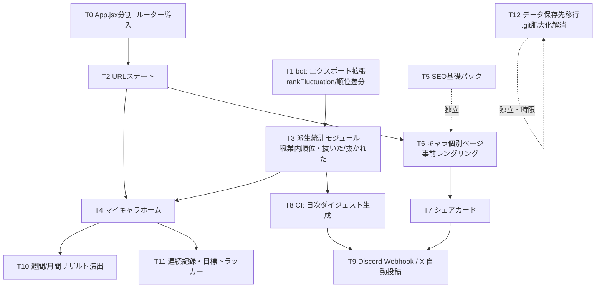

# lulumi-tools 統合ロードマップ — 最終設計地図（2026-07-06）

これまでの戦略レビュー(`lulumi-tools_review_2026-07-06.md`)・改善計画(`lulumi-tools_improvement_plan.md`)を統合した、**Codex に順番に実装させるための設計地図**。実装はまだ行わない。

決定済みの前提:
- 取得対象は Lv225+ のまま拡大しない(225未満はサブキャラとして切り捨て)
- バックエンドサーバーは持たない(GitHub Pages 静的+CI のみ)
- bot/取得パイプラインは競合優位が確立済み。大改修しない

---

## 1. 各プロダクトの役割

| プロダクト | 役割 | 成功の定義 |
|---|---|---|
| **EXPランキング**(既存) | 集客の入口・信頼の源泉。「正確で全数」という他が真似できない資産 | データ鮮度と正確性の維持。ここは守るだけ |
| **マイキャラホーム**(新規) | リテンションエンジン。主語を「あなた」に変え、毎朝9時に開く習慣を作る | ピン留め率30%、ピン済みユーザーの週3回以上再訪50% |
| **SEO/共有**(新規) | 獲得と拡散。キャラ個別URL+OGカードで Discord/X/検索から人を連れてくる | 流入の過半を検索+SNS参照に |
| データ基盤(既存bot/CI) | 上記3つの土台。追加改修は「エクスポート項目の追加」と「保存先移行」のみ | CI が止まらない・`.git` が破綻しない |
| 統計/コンテンツ(新規・後発) | サーバー統計・シーズン記録。被リンク獲得の看板 | 外部サイト/Reddit/Discord からの引用 |

3つの関係: **SEO/共有が連れてきて → EXPランキングが信頼させて → マイキャラホームが引き留める。**

---

## 2. 実装順序と依存関係

### 依存グラフ

### 順序の原則

1. **T0(App.jsx 分割+ルーター)を最初にやる。** 963行のモノリスに複数機能を並行追加すると Codex のタスクが全部衝突する。これが全タスクの並列化を可能にする唯一の投資。
2. **データ契約(bot エクスポート)の変更は独立タスクとして先行させる。** フロントは JSON に項目がある前提で書けるようになり、bot と web のタスクを分離できる。
3. **URL が先、共有が後。** 貼れるリンクが無い状態でシェアカードを作っても無駄になる。
4. SEO 基礎パック(T5)は依存ゼロなので、いつでも差し込める(初週に済ませるのが得)。
5. 保存先移行(T12)は機能と無関係だが**3ヶ月以内の時限**。

---

## 3. 先に作ると無駄になるもの(アンチロードマップ)

| やりがちな順序 | なぜ無駄か |
|---|---|
| シェアカードを先に作る | キャラ個別URLが無いとカードの行き先がトップページになり効果が出ない。T3(ルーティング)後に |
| 事前レンダリングを先に作る | URL設計(パス形式・正規URL・言語の扱い)が決まる前に作ると全ページ作り直しになる |
| Discord **Bot**(常駐型)を作る | サーバーレス方針に反する。CI からの Webhook 送信で同じ価値の9割が出る。Bot 化は需要が実証されてから |
| 旧v1 JSON(62MB)に関わる改修 | 廃止予定の資産。触らず、除去だけする |
| 225未満向け機能(Road to the Board 等) | 方針決定により対象外。着手しない |
| モノリスのまま機能追加 | すべての後続タスクのコンフリクト源になる。T0 が先 |
| 攻略ツール(ボス計算機)を前半にやる | ゲームデータ収集という別種の作業が必要で、リテンション/SEO の複利を遅らせる。後半に |
| web テスト基盤の大整備 | 全面導入は過剰。派生統計モジュール(T3)の純粋関数にだけ vitest を入れるのが費用対効果最大 |

---

## 4. 今作っておくと後で効く基盤

| 基盤 | 効く先 |
|---|---|
| **ルーター+ページ分割**(T0) | 以降の全機能。ページ=タスクの単位になり Codex に切り出しやすくなる |
| **キャラ正準ID の統一**(historyKey/assetKey をURL・ピン留め・比較の共通キーに) | 個別ページ、マイキャラ、シェア、改名耐性。場当たりに name をキーにすると後で全部書き直す |
| **派生統計モジュール**(T3: 職業内/サーバー内順位、順位入れ替わり、連続記録、パーセンタイルを純粋関数で) | マイキャラホーム・キャラ詳細・シェアカード・日次ダイジェストの全部が同じ関数を呼ぶ。テストもここに集中 |
| **ユーザープロファイル層**(localStorage: ピン・目標・既読・言語を1モジュールに集約。既存 favorites/groups を吸収) | マイキャラ、目標トラッカー、通知既読管理。将来アカウント制に移行する時の互換層になる |
| **CI のカード/ダイジェスト生成ステップ**(JSON→画像/テキストを1ジョブに) | Discord・X・OG画像の3用途で共用 |
| **エクスポートのメタ項目拡張**(T1) | フロントの計算を減らし、個別ページの静的生成にも同じデータを使う |
| **i18n キーの全6言語同時追加を規約化** | 後からの翻訳穴埋め作業を根絶 |

---

## 5. ロードマップ

### 〜6ヶ月(確定計画)

| 月 | テーマ | タスク |
|---|---|---|
| **1** | 基盤+守り | T0 App分割+ルーター / T1 botエクスポート拡張 / T5 SEO基礎パック / 62MB旧JSON除去 / クイックウィン(favicon・英語title・順位変動▲▼・サムネイル) |
| **2** | リテンションの核 | T2 URLステート+リンクコピー / T3 派生統計モジュール(+vitest) / T4 マイキャラホーム(ピン留め・成績表・抜いた/抜かれた・職業内/サーバー内順位=JobGainRankings回収) |
| **3** | SEO主戦場+時限対応 | T6 キャラ個別ページ事前レンダリング(上位1,000体→全体) / **T12 データ保存先移行+git履歴掃除** / 取得失敗のDiscord通知 |
| **4** | 拡散装置 | T7 シェアカード / T8-T9 CI日次ダイジェスト→Discord Webhook+X自動投稿 / ミルストーンフィード |
| **5** | 習慣の強化 | T10 週間/月間リザルト演出(木曜・月初の確定カード) / T11 連続記録・自己ベスト・目標トラッカー |
| **6** | モバイル+看板 | PWA化+カード型モバイルUI / サーバー統計ページ(レベル分布・職業シェア・250/275到達推移) |

### 7〜12ヶ月(方向性。6ヶ月時点の数字で取捨)

| 期間 | テーマ | 内容 |
|---|---|---|
| 7-8月目 | 攻略必須ツール | ボス突破判定 or 育成効率計算(MapleBoss Battle Calc 対抗)。EXPランキングと相互送客 |
| 8-9月目 | シーズン/アーカイブ | 90日で消える履歴を月次アーカイブ化し「シーズン記録」「歴代殿堂」ページに。独自コンテンツ&SEO資産 |
| 9-10月目 | 収益化 | Ko-fi/寄付 → 統計・キャラページ限定の控えめな広告。コアUXには入れない。Nexonファンポリシー確認を先行 |
| 10-12月目 | エコシステム | 公開API/CSVエクスポート、Discord Bot 化(需要実証後)、ギルド/グループの共有URL、他言語コミュニティ展開(th/vi の告知) |

判断ゲート: 6ヶ月時点で「ピン留め率」「検索+SNS流入比率」が目標未達なら、7ヶ月目以降の幅出しより P0-P2 の磨き込みを優先する。

---

## 6. Codex に渡すときのタスク分解方針

### 分解の単位
- **1タスク=1PR=1関心事。** 「リファクタと機能追加を混ぜない」を厳守(T0 は純リファクタ、T4 は純機能)。
- 縦割りではなく**層で切る**: ①データ契約(bot/JSON) → ②純粋関数(派生統計) → ③UIコンポーネント → ④配線(ページ組み込み)。各層が独立に検証可能。
- App.jsx を触るタスクは**同時に1つだけ**走らせる(T0 完了後はこの制約が消える)。

### 各タスクに必ず含めるもの
1. **目的**(1行)と**ユーザーから見た変化**
2. **触ってよいファイル/触ってはいけないファイル**(例: 「bot の取得ロジック `main.py` の fetch 系関数は変更禁止。`mvp_export.py` のみ」)
3. **データ契約**: 入出力 JSON の具体例(v2 サマリー/シャードの実サンプルを貼る)
4. **受け入れ条件**: `npm run build` 成功 / bot 変更時は `pytest` 通過 / i18n キーは6ロケール全部に追加 / 旧v1フォーマットに触れない / recharts 等の新規依存追加は事前承認制
5. **確認手順**: `run_local_dev.bat` 相当のローカル確認方法

### Codex に渡す標準コンテキスト
- 本ファイル(設計地図)+該当タスクの詳細
- 関連ソース: `App.jsx` / `rankingUtils.js` / `mvp_export.py` / `historyData.js` / i18n locales
- 制約の明文化: 静的サイトである(サーバーコード禁止)・localStorage のキー命名規約・キャラ正準IDは historyKey

### 実装順のタスクキュー(最初の10個)
| # | タスク | 種別 | 依存 |
|---|---|---|---|
| T0 | App.jsx をページ/コンポーネントに分割し、ルーター(まずhashルーティング)導入。挙動変更ゼロ | リファクタ | なし |
| T1 | `mvp_export.py`: rankFluctuation・前日レベル順位・職業内/サーバー内順位を characters に追加 | bot | なし |
| T5 | SEO基礎パック(英語メタ・OG・favicon・sitemap生成をCIに追加・robots・hreflang) | 静的 | なし |
| QW | 62MB旧JSONの配信除去+v2失敗時のエラーメッセージ | 小 | なし |
| T2 | URLステート(`#/character/:key`・`?sort=&world=`)+リンクコピー | web | T0 |
| T3 | 派生統計モジュール(抜いた/抜かれた・連続記録・パーセンタイル)+vitest | web | T1 |
| T4a | ユーザープロファイル層(ピン留め、favorites/groups 吸収) | web | T0 |
| T4b | マイキャラホーム画面(成績表+抜かれた表示+職業内順位) | web | T2,T3,T4a |
| T12 | ranking.db の保存先を Releases/外部へ移行+履歴掃除 | CI | なし(時限) |
| T6 | キャラ個別ページの事前レンダリング(ビルドスクリプト+OGタグ) | web/CI | T2 |

---

## 7. 一枚要約

**「T0で地ならし → T1-T4で毎日見る理由 → T5-T7で貼れる・見つかる → T8以降で自動拡散」**。
先にリファクタとデータ契約、次にリテンション、その次に獲得、最後に幅出し。`.git` 移行だけは独立の時限タスク。すべて静的サイトの範囲内で完結し、bot の取得ロジックには触れない。
